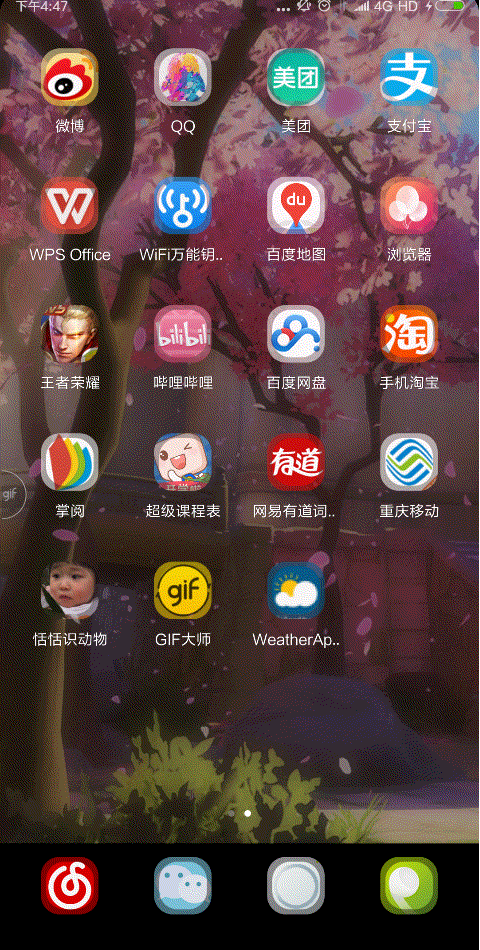

# Assignment
王丹 20151631



## Step1:adding the new icon to the application
### 1.

### 2.

### new icon finished
## Step2:adding the blue background
### 1.create file "attrs.xml" in values
```
<shape
    xmlns:android="http://schemas.android.com/apk/res/android"
    android:shape="oval"
    android:useLevel="false" >

    <padding
        android:left="2dp"
        android:top="1dp"
        android:right="2dp"
        android:bottom="1dp" />

    <stroke
        android:width="5dp"
        android:color="#FFFFFF" />
    <size android:width="25dp"
        android:height="25dp" />
</shape>
```
### 2.Create Java file "MyCustomView.java" in order to draw a circle on my own
```
package mg.studio.weatherappdesign;

        import android.content.Context;
        import android.content.res.Resources;
        import android.content.res.TypedArray;
        import android.graphics.Canvas;
        import android.graphics.Color;
        import android.graphics.Paint;
        import android.graphics.Rect;
        import android.util.AttributeSet;
        import android.view.View;

/**
 *  Description:自定义控件View
 * Created by Dan on 2018/3/15.
 */

public class MyCustomView  extends View{

    private static final String TAG = "MyCustomView";
    private static final boolean DEBUG = false;
    private String titleText = "Hello world";

    private int titleColor = Color.WHITE;
    private int titleBackgroundColor = Color.BLUE;
    private int titleSize = 16;

    private Paint mPaint;
    private Rect mBound;

    public MyCustomView(Context context) {
        this(context, null);
    }

    public MyCustomView(Context context, AttributeSet attrs) {
        this(context, attrs, 0);
    }

    public MyCustomView(Context context, AttributeSet attrs, int defStyleAttr) {
        super(context, attrs, defStyleAttr);

        final Resources.Theme theme = context.getTheme();
        TypedArray a = theme.obtainStyledAttributes(attrs,
                R.styleable.MyCustomView, defStyleAttr, 0);
        if (null != a) {
            int n = a.getIndexCount();
            for (int i = 0; i < n; i++) {
                int attr = a.getIndex(i);
                switch (attr) {
                    case R.styleable.MyCustomView_titleColor:
                        titleColor = a.getColor(attr, Color.BLACK);
                        break;
                    case R.styleable.MyCustomView_titleSize:
                        titleSize = a.getDimensionPixelSize(attr, titleSize);
                        break;
                    case R.styleable.MyCustomView_titleText:
                        titleText = a.getString(attr);
                        break;
                    case R.styleable.MyCustomView_titleBackgroundColor:
                        titleBackgroundColor = a.getColor(attr, Color.WHITE);
                        break;
                }
            }
            a.recycle();
            init();
        }
    }

    /**
     * 初始化
     */
    private void init() {
        mPaint = new Paint(Paint.ANTI_ALIAS_FLAG);
        mPaint.setTextSize(titleSize);
        /**
         * 得到自定义View的titleText内容的宽和高
         */
        mBound = new Rect();
        mPaint.getTextBounds(titleText, 0, titleText.length(), mBound);
    }


    @Override
    public void onDraw(Canvas canvas) {
        mPaint.setColor(titleBackgroundColor);
        canvas.drawCircle(getWidth() / 3f, getWidth() / 3f, getWidth() / 2f, mPaint);
        mPaint.setColor(titleColor);
        canvas.drawText(titleText, getWidth() / 3 - mBound.width() / 3, getHeight() / 3+ mBound.height() / 3, mPaint);
    }
}

```
### 3.change some pieces of code in activity_main.xml
```
xmlns:custom="http://schemas.android.com/apk/res-auto"

<mg.studio.weatherappdesign.MyCustomView
                 android:layout_width="wrap_content"
                 android:layout_height="wrap_content"
                 custom:titleColor="#909090"
                 custom:titleSize="17sp"
                 custom:titleBackgroundColor="#8DEEEE"
                 custom:titleText="mon" />
```
### blue background finished

## Step3:adding the refresh button
### 1.create a file called "button.xml" in drawable
```
<shape
    xmlns:android="http://schemas.android.com/apk/res/android"
    android:shape="oval"
    android:useLevel="false" >

    <padding
        android:left="2dp"
        android:top="1dp"
        android:right="2dp"
        android:bottom="1dp" />

    <stroke
        android:width="5dp"
        android:color="#FFFFFF" />
    <size android:width="25dp"
        android:height="25dp" />
</shape>
```
### 2.add a piece of code in activity_main.xml
```
<TextView
                    android:id="@+id/temperature_of_the_day"
                    android:layout_width="match_parent"
                    android:layout_height="wrap_content"
                    android:gravity="right"
                    android:text="28"
                    android:textColor="@android:color/white"
                    android:textSize="100sp"
                    android:textStyle="bold" />

```

### refresh button finished

## Step4:when the refresh button is pressed, the temperature, the date and the day of the week are all updated
### add a piece of code in "MainActivity.java"
```
Button refresh_but = (Button) findViewById(R.id.update);
        final TextView xingqi = (TextView) findViewById(R.id.xingqi);
        final TextView myDate = (TextView) findViewById(R.id.tv_date);
        final TextView myCity = (TextView) findViewById(R.id.tv_location);
        final TextView wendu = (TextView) findViewById(R.id.temperature_of_the_day);
        refresh_but.setOnClickListener(new View.OnClickListener() {
            @Override
            public void onClick(View v) {
                
                final Calendar c = Calendar.getInstance();
                c.setTimeZone(TimeZone.getTimeZone("GMT+8:00"));
                mYear = String.valueOf(c.get(Calendar.YEAR));                 // 获取当前年份     year
                mMonth = String.valueOf(c.get(Calendar.MONTH) + 1);           // 获取当前月份     month
                mDay = String.valueOf(c.get(Calendar.DAY_OF_MONTH));          // 获取当前月份的日期号码      day
                mWay = String.valueOf(c.get(Calendar.DAY_OF_WEEK));
                if ("1".equals(mWay)) {
                    xingqi.setText("SUNDAY");
                } else if ("2".equals(mWay)) {
                    xingqi.setText("MONDAY");
                } else if ("3".equals(mWay)) {
                    xingqi.setText("TUESDAY");
                } else if ("4".equals(mWay)) {
                    xingqi.setText("WENDNESDAY");
                } else if ("5".equals(mWay)) {
                    xingqi.setText("THURSDAY");
                } else if ("6".equals(mWay)) {
                    xingqi.setText("FRIDAY");
                } else if ("7".equals(mWay)) {
                    xingqi.setText("SATURDAY");
                }
                myDate.setText(mMonth + "/" + mDay + "/" + mYear);   //03/03/2018
                myCity.setText("重庆");
                new DownloadUpdate().execute();
                //wendu.setText("19");
    
            Toast.makeText(MainActivity.this, "Update successfully", Toast.LENGTH_SHORT).show();
            }
        });

    }
```

### refresh finished

## result picture
